# Nifty100 Database Project

## Overview
This project builds a structured SQLite database for Nifty100 companies using multiple financial datasets.

## Objectives
- Load and normalize source data
- Validate data quality
- Create database schema
- Store data in SQLite
- Generate audit and validation reports

## Tech Stack
- Python
- Pandas
- SQLite
- SQLAlchemy
- Git & GitHub

## Project Structure
- data/
- src/
- tests/
- logs/

## Author
Lella Anusha Reddy

# Project Status

## Day 1
- Project setup completed
- Data ingestion / initial structure created
- Git repository initialized

## Day 2
- Implemented normalization functions
- Added 35 unit test cases
- All tests passed successfully
- Verified edge cases

## Status
✔ Day 1 completed  
✔ Day 2 completed

# Day 3
 Schema Validator

Completed

- Loaded Excel files
- Checked null values
- Checked duplicate rows
- Validated company IDs
- Validated balance sheet
- Generated "validation_failures.csv"

run

python src/data/validator.py

Status: ✅ Completed

# Day4 completed
– SQLite Database Schema

## Objective
Create the SQLite database schema for the Nifty100 project.

## Tasks Completed
- Created SQLite database: `nifty100.db`
- Enabled foreign key constraints using `PRAGMA foreign_keys = ON`
- Created 10 database tables
- Defined Primary Keys (PK)
- Defined Foreign Keys (FK)
- Verified schema creation successfully

## Tables Created
1. companies
2. balancesheet
3. profitandloss
4. cashflow
5. stock_prices
6. financial_ratios
7. market_cap
8. peer_groups
9. sectors
10. load_audit

## Files Added
- `db/schema.sql`
- `create_db.py`
- `nifty100.db`

python create_db.py

## Day 5 completed
full data load

## Day 6 completed
 SQL validation

## day 7 completed
exploratory_queries.sql
validation reports


SPRINT 2 — FINANCIAL RATIO ENGINE

## Day 8 completed
Added financial ratio calculations and unit tests

## Day 9 completed
 Added leverage and efficiency ratios

 ## Day 10 completed
 Added CAGR engine and unit tests

 ## Day 11 completed
 added cash flow KPIs and capital allocation
## Day 12 completed
financial ratios completed
## Day 13 completed
 Bank ROCE carve-out and edge case logging completed

## Day 14 completed
tests and sprint review completed

## Day 15 completed
Filter Engine Core completed

## Day 16 completed
 preset screeners completed

  ## Day 17 completed
  composite score and export completed

  ## Day 18 completed
  Peer Percentile Rankings completed
  ## Day 19 completed
  Generated radar chart completed

  ## Day 21 completed
  Final Screener and Analytics Completed

  ## Day 22 completed
  Streamlit Dashboard completed

  ## Day 23 completed
   Dashboard completed

  ## Day 24 completed
   Added screener and peers analysis logic
   
# Nifty 100 Financial Analysis Dashboard

## Overview

A Streamlit dashboard for analysing Nifty 100 companies using financial statements, valuation metrics, sector comparisons and stock screening.

## Features

- Company Profile
- Financial Trends
- Sector Analysis
- Peer Comparison
- Stock Screener
- Capital Allocation
- Valuation Analysis
- Reports Export

## Technologies

- Python
- Streamlit
- Pandas
- Plotly
- SQLite

## Project Structure

src/
dashboard/
analytics/
output/
data/

## Run

```bash
streamlit run src/dashboard/app.py

Outputs
valuation_summary.xlsx
valuation_flags.csv
screener_output.xlsx

## Dashboard Screens

## App
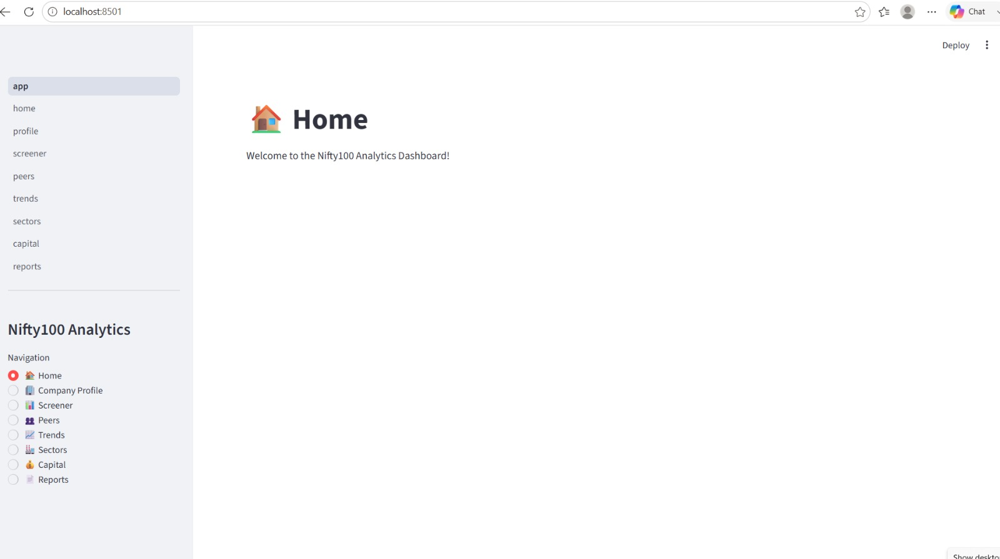
### Home
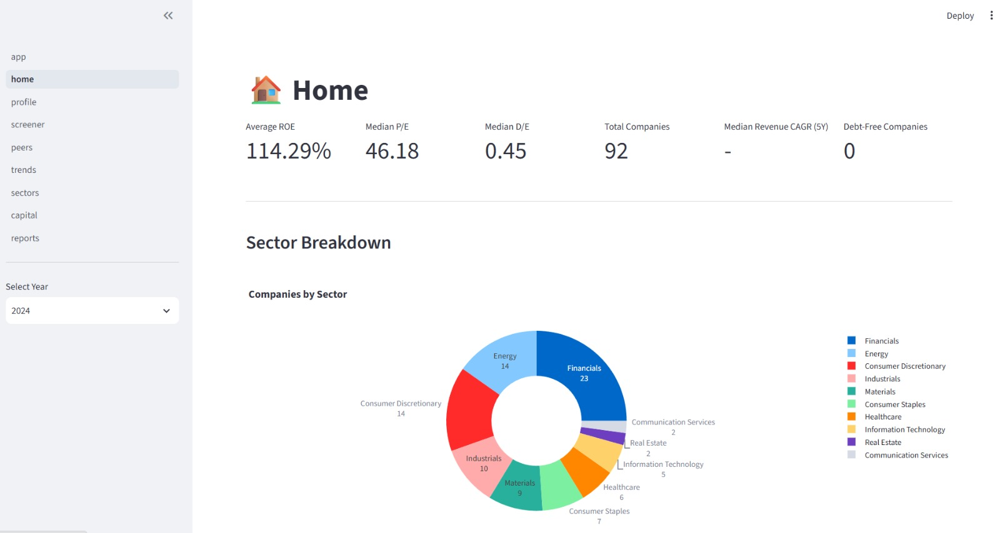
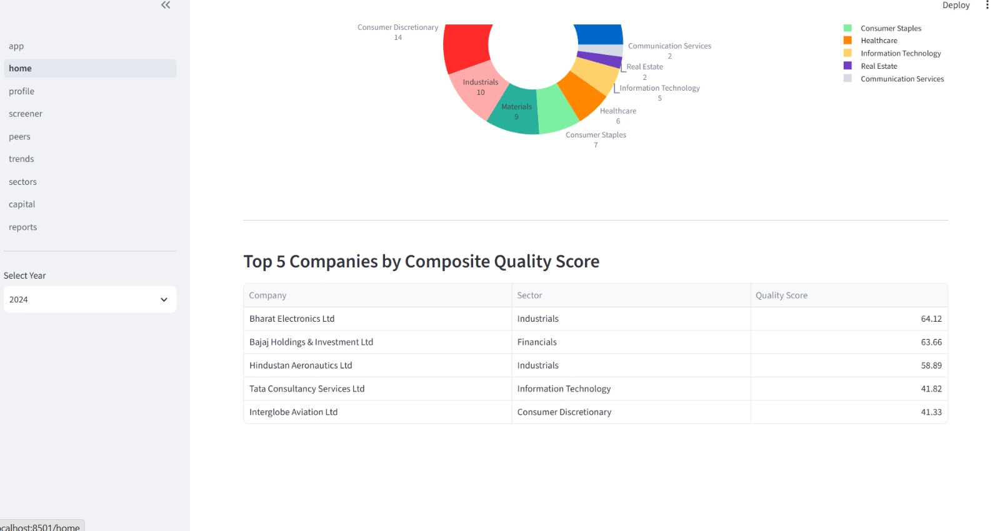

### Company Profile
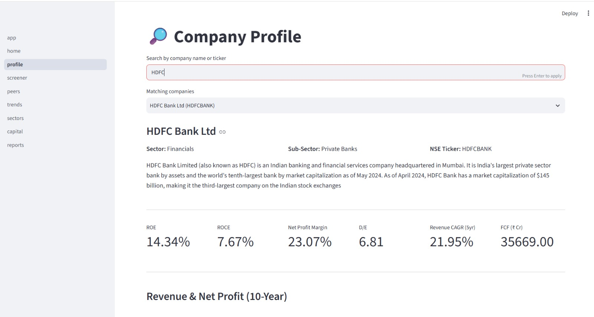
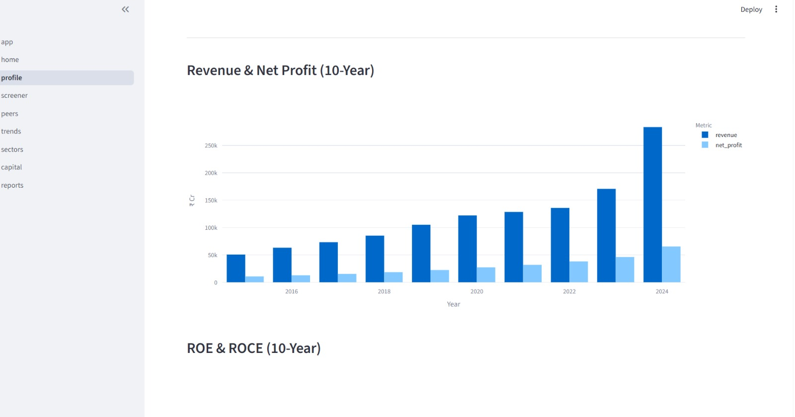
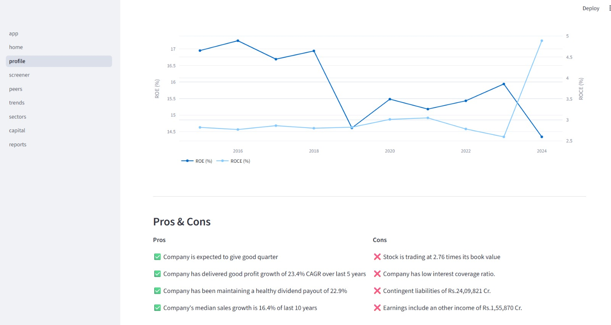
### Screener
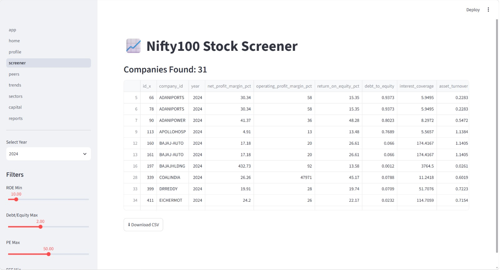

### Peers


### Trends
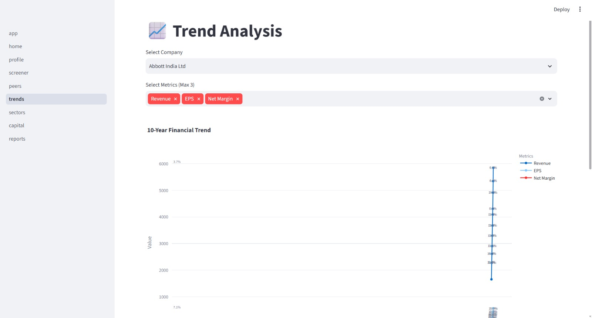
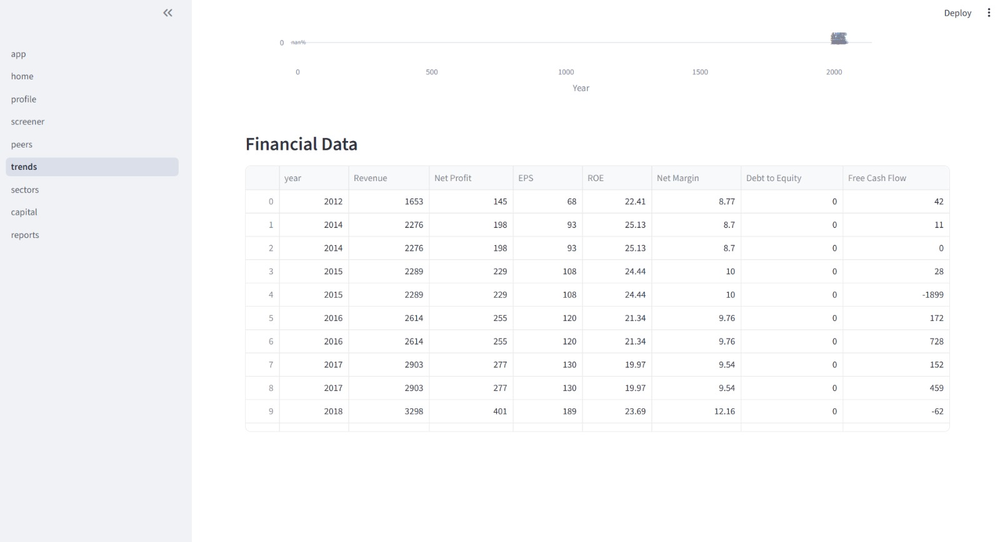
### Sectors

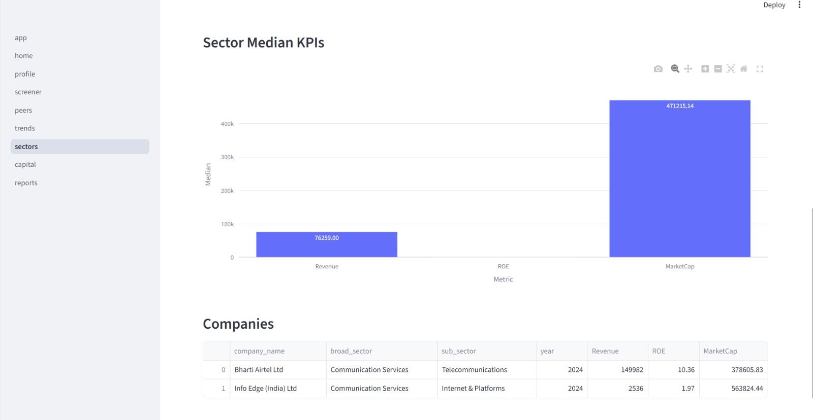
### Capital
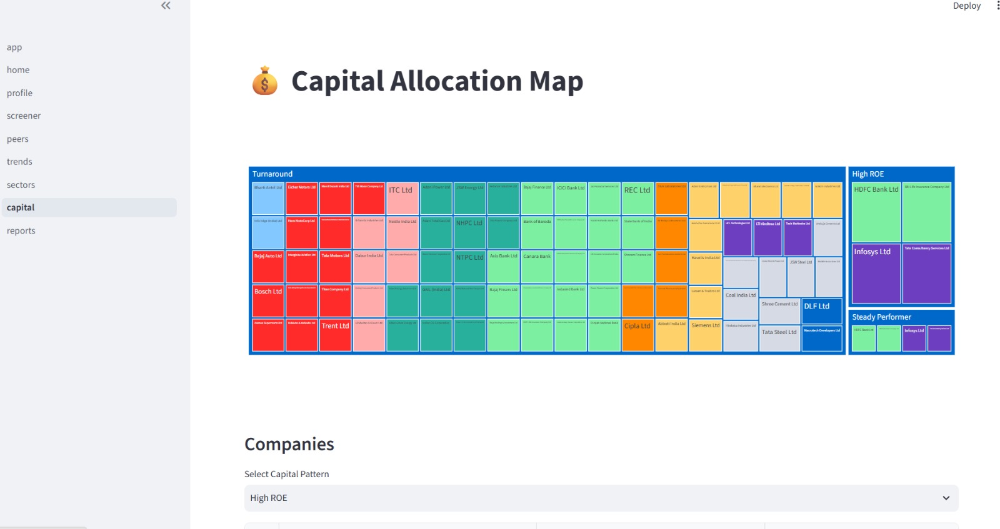
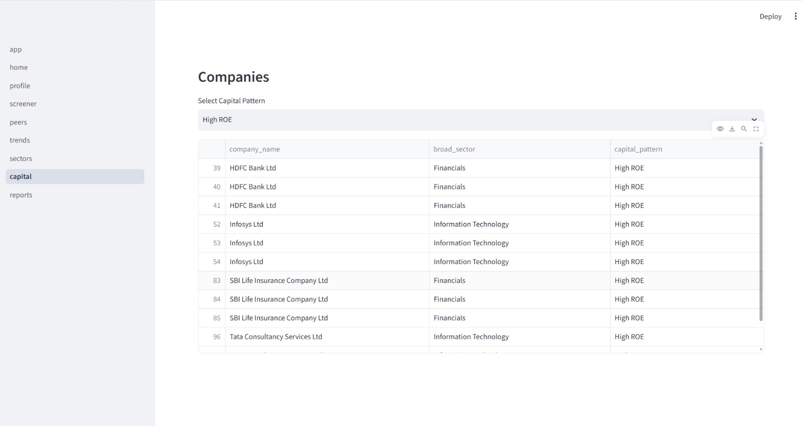

### Reports

    

## Sprint 4 Retrospective

### Completed Features
- Multi-page Streamlit dashboard with 8 screens
- Company Profile with financial summary
- Stock Screener with filters and CSV export
- Peer comparison analysis
- Trend charts and sector analysis
- Capital structure visualization
- Valuation reports
- Cached database loading for faster performance

### Issues Fixed
- Fixed Pros & Cons table import
- Fixed missing data handling
- Fixed chart sizing issues
- Improved page loading performance
- Added graceful handling for unavailable values

### Performance
- Dashboard loads successfully
- Company Profile loads in under 3 seconds
- Tested across multiple companies

### Final Status
Sprint 4 completed successfully.

Sprint 5
Complete Day 29 NLP analysis parser and parsed output generation

## Day 30 completed
 NLP — Auto Pros/Cons Generator completed

## Day 31 completed

 Cash Flow KPI analysis

## Day 32 completed

capital allocation report

## Day 33 completed

pdf tearsheets template

## Day 34 completed

batch report generation

## Day 35 completed

portfolio summary report


